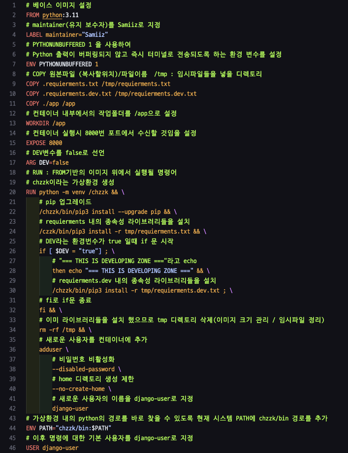

# chzzk_django_api
practice django chzzk api

## Docker setting
    1. requirements.(.dev)txt를 이용하여 사용할 라이브러리들을 정한다.
        - 기본적으로 django관련 라이브러리 세팅
    2. Dockerfile로 이미지가 생성되는 과정을 정의한다.
        - python 3.11 베이스로 
### dockerfile

details

[Dockerfile](./Dockerfile)

## Django setting

## AWS setting

## distribution